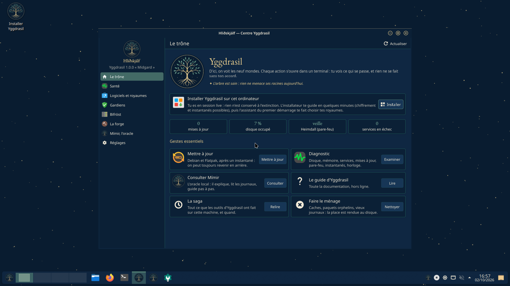
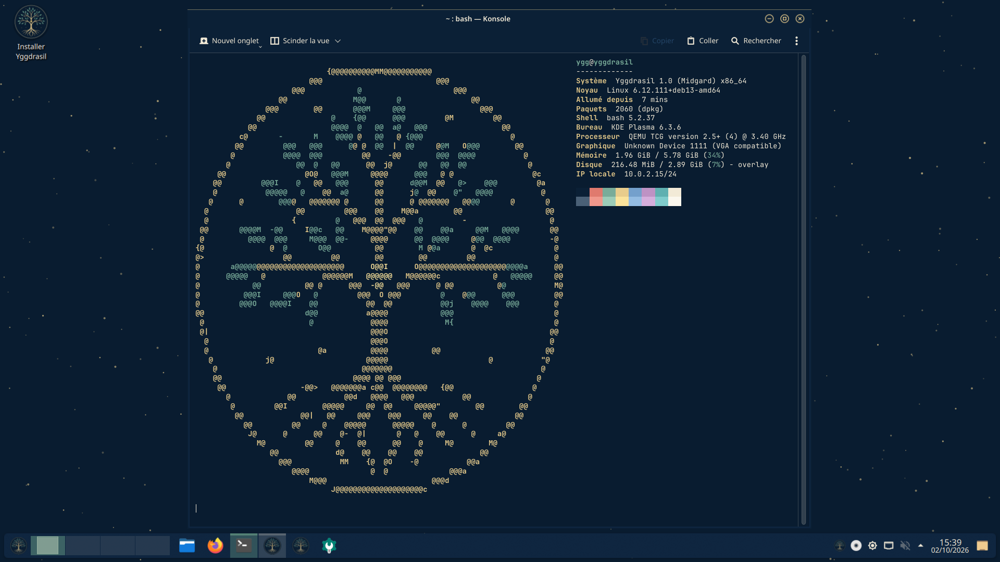
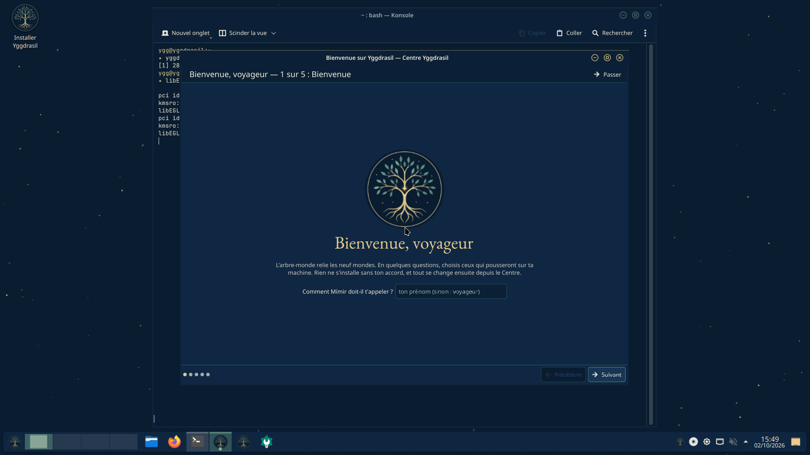
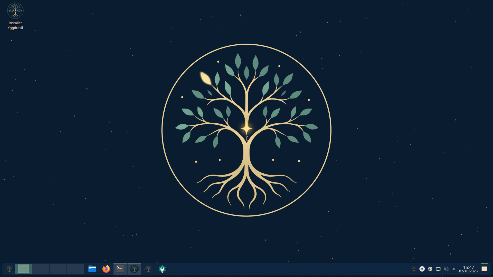
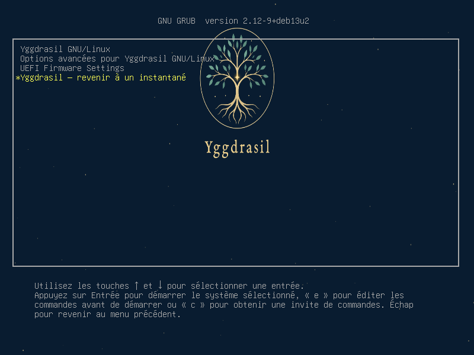
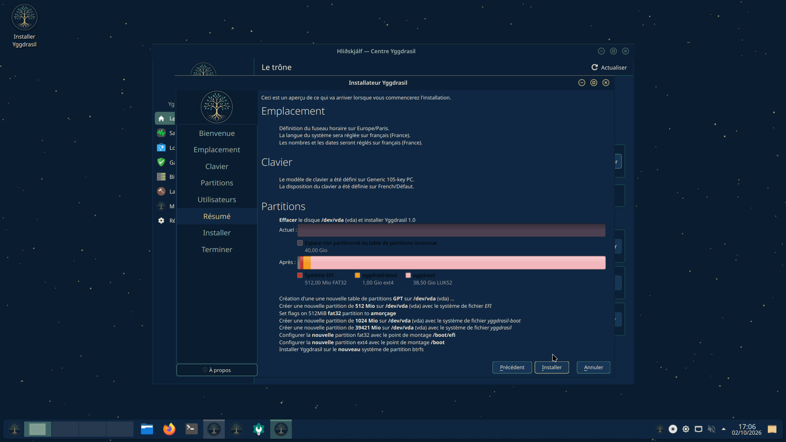
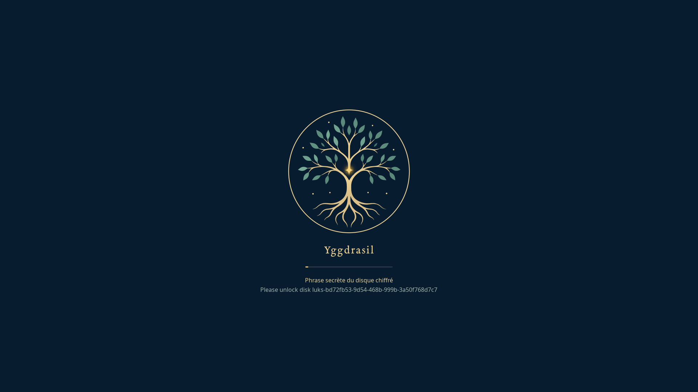
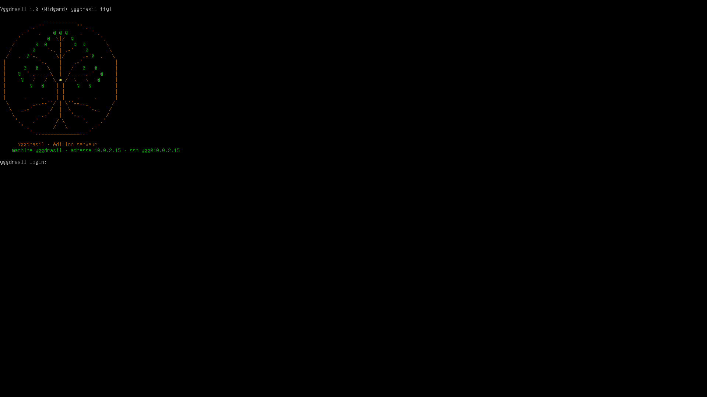
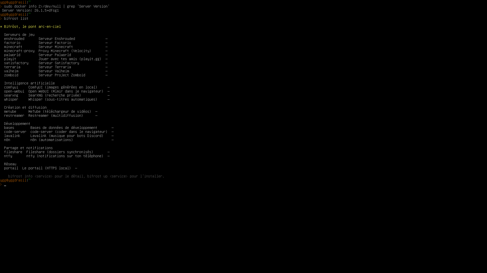

<div align="center">


# Yggdrasil

**L'arbre qui relie tes mondes.**

Une distribution Linux en français, construite sur Debian 13, avec un bureau KDE Plasma aux couleurs
de la nuit, de l'or et de la sauge, et une famille d'outils qui ne font jamais rien sans ton accord.

[](https://github.com/NaiSora/YggdrasilOS/releases/latest)
[](https://www.debian.org/releases/trixie/)
[](https://kde.org/plasma-desktop/)
[](#)

[**Le site**](https://naisora.github.io/YggdrasilOS/) ·
[Télécharger](https://naisora.github.io/YggdrasilOS/#telecharger) ·
[Installer](#installer) ·
[Premiers pas](#premiers-pas) ·
[Les outils](#les-outils-de-larbre) ·
[Les neuf mondes](#les-neuf-mondes) ·
[Construire](#construire-depuis-les-sources)



</div>

## L'arbre-monde

Dans la mythologie nordique, Yggdrasil est le frêne qui relie les neuf mondes. Ici, c'est un système
complet : une image ISO qu'on démarre depuis une clé USB, qu'on essaie sans rien toucher, puis qu'on
installe en quelques clics. Dessous, c'est **Debian**, sans rien forker : `apt`, les dépôts et la
documentation Debian s'appliquent tels quels. Par-dessus, Yggdrasil ajoute ce qui manque d'habitude.

- **Tout en français**, du menu de démarrage aux messages de la console.
- **Rien sans ton accord.** Chaque outil montre ce qu'il va faire avant de le faire, et `-n` simule tout.
- **Le retour en arrière est toujours possible.** Avant chaque mise à jour, un instantané du système ;
  et sur btrfs, chacun apparaît au menu de démarrage.
- **Ton IA reste chez toi.** Mímir, l'oracle, tourne sur ta machine : aucune donnée ne part.
- **Des mondes à la carte.** Jeu, création, développement, serveurs… tu choisis au premier démarrage,
  et chaque monde installé allume une feuille d'or sur le fond d'écran.

## Aperçu

<table>
  <tr>
    <td width="50%"></td>
    <td width="50%"></td>
  </tr>
  <tr>
    <td align="center"><sub>Chaque terminal s'ouvre sur l'arbre-monde et l'état du système.</sub></td>
    <td align="center"><sub>« Bienvenue, voyageur » : cinq questions pour choisir tes mondes et tes gardiens.</sub></td>
  </tr>
  <tr>
    <td></td>
    <td></td>
  </tr>
  <tr>
    <td align="center"><sub>L'arbre vivant : chaque monde installé allume sa feuille.</sub></td>
    <td align="center"><sub>Le menu de démarrage, en français, propose de revenir à un instantané.</sub></td>
  </tr>
  <tr>
    <td></td>
    <td></td>
  </tr>
  <tr>
    <td align="center"><sub>L'installateur : btrfs, instantanés et chiffrement du disque.</sub></td>
    <td align="center"><sub>Au démarrage, l'arbre pousse ; la phrase secrète se tape au clavier français.</sub></td>
  </tr>
  <tr>
    <td></td>
    <td></td>
  </tr>
  <tr>
    <td align="center"><sub>L'édition serveur : l'adresse de la machine et la commande SSH, avant même la connexion.</sub></td>
    <td align="center"><sub>Bifröst : serveurs de jeu, IA locale, partage… chacun en une commande.</sub></td>
  </tr>
</table>

## Télécharger

Les images sont sur [**le site**](https://naisora.github.io/YggdrasilOS/#telecharger), qui propose la
[dernière release](https://github.com/NaiSora/YggdrasilOS/releases/latest) ; ses [nouveautés](https://naisora.github.io/YggdrasilOS/notes.html)
racontent chaque version, et [toutes les releases](https://github.com/NaiSora/YggdrasilOS/releases) restent
téléchargeables.

| Édition | Pour qui | Fichiers |
|---|---|---|
| **Bureau** | Un PC de tous les jours : bureau Plasma, session live, installateur graphique | `yggdrasil-1.0.1-amd64.iso.001` et `.002` (≈ 3,3 Go en tout) |
| **Serveur** | Une machine sans écran : console, SSH, Docker pour les services de Bifröst | `yggdrasil-serveur-1.0.1-amd64.iso` (≈ 1,8 Go) |

GitHub limite chaque fichier à 2 Go : l'ISO bureau est donc livrée **en deux morceaux**, à recoller
une fois téléchargés (dans le dossier des téléchargements).

```powershell
# Windows (PowerShell ou invite de commandes)
cmd /c copy /b yggdrasil-1.0.1-amd64.iso.001 + yggdrasil-1.0.1-amd64.iso.002 yggdrasil-1.0.1-amd64.iso
Get-FileHash yggdrasil-1.0.1-amd64.iso      # à comparer avec SHA256SUMS
```

```bash
# Linux ou macOS
cat yggdrasil-1.0.1-amd64.iso.001 yggdrasil-1.0.1-amd64.iso.002 > yggdrasil-1.0.1-amd64.iso
sha256sum -c SHA256SUMS --ignore-missing
```

Les releases ne portent que les images. Les **sources** de tout ce qu'elles contiennent, aux versions exactes,
comme le demande la GPL, sont publiées à part, dans
[**YggdrasilOS-sources**](https://github.com/NaiSora/YggdrasilOS-sources/releases) : une release par version,
au même numéro, avec les paquets Debian du système et ce que l'image contient en plus (l'installateur
Debian, les chargeurs d'amorçage signés, le code que d'autres paquets embarquent).

**Configuration conseillée** : un PC 64 bits (x86-64), UEFI (Secure Boot compris) ou BIOS.

| | Bureau | Serveur |
|---|---|---|
| Mémoire | 4 Go (8 Go pour Mímir, l'IA locale) | 2 Go |
| Disque | 30 Go | 16 Go |

## Installer

1. **Écris l'ISO sur une clé USB** (8 Go ou plus ; elle sera effacée).
   Sous Windows : [Rufus](https://rufus.ie) en **mode DD** (Rufus le propose pour cette image hybride) ou
   [balenaEtcher](https://etcher.balena.io). Sous Linux : `sudo dd if=yggdrasil-1.0.1-amd64.iso of=/dev/sdX bs=4M status=progress oflag=sync`.
   Depuis Yggdrasil, `skidbladnir ecrire sdX --persistance 16G` en fait une clé qui garde tes fichiers.
2. **Démarre sur la clé** : touche du menu de démarrage au lancement du PC (souvent F12, F8, F11 ou Échap).
   Le menu propose la session live, l'installateur en mode texte, et un mode sans échec.
3. **Essaie sans rien installer.** La session live s'ouvre d'elle-même (utilisateur `ygg`, mot de passe
   `live`) : tout est là, le Centre, les outils, les applications.
4. **Installe** avec l'icône *Installer Yggdrasil* du bureau (ou le bouton du Centre). L'installateur te
   demande la langue, le fuseau horaire, le clavier, le disque, puis ton compte. Par défaut, le système
   est en **btrfs** (instantanés immédiats) ; coche *Chiffrer le système* pour protéger le disque par une
   phrase secrète. Il sait aussi s'installer à côté de Windows : le menu de démarrage proposera les deux.
5. **Au premier démarrage**, l'assistant *Bienvenue, voyageur* te demande comment Mímir doit t'appeler,
   quel voyageur tu es (joueur, créateur, développeur, gardien de serveurs), quels mondes faire pousser et quels
   gardiens activer. Rien ne s'installe sans ton accord, et tout se change ensuite depuis le Centre.

**L'édition serveur** s'installe avec l'installateur Debian en mode texte, préréglé en français. Au
démarrage, la console affiche l'arbre-monde, l'adresse de la machine et la commande pour s'y connecter :
`ssh ygg@192.168.1.42`. SSH et Docker sont prêts, et Heimdall, le pare-feu, laisse passer SSH.

## Premiers pas

Le **Centre** (Hliðskjálf, le trône d'Odin) rassemble tout : santé de la machine, logiciels et mondes,
gardiens, services, projets, l'oracle et les réglages. Chaque action s'ouvre dans un terminal, pour que
tu voies ce qui se passe. Et tout existe aussi en ligne de commande :

```bash
ygg                       # le menu du gestionnaire système
ygg update                # tout mettre à jour, après un instantané
ygg doctor                # le diagnostic : disque, mémoire, services, pare-feu, pilotes…
ygg realm add muspelheim  # faire pousser un monde (ici : le jeu vidéo)
ygg annuler               # défaire la dernière action d'Yggdrasil
mimir chat                # parler à l'oracle (100 % local)
mimir pourquoi            # expliquer la dernière commande qui a échoué
heimdall status           # le pare-feu, et ce qui est ouvert
norns snap                # un instantané du système, tout de suite
norns backup --to /media/disque   # sauvegarder ton dossier personnel
bifrost up minecraft --type fabric --nom survie   # un serveur Minecraft avec ses mods
brokkr new discord-bot MonBot     # un projet prêt à coder
```

Ajoute `-n` à n'importe quelle commande pour voir ce qu'elle ferait, sans rien toucher. Le guide complet
est hors ligne, dans le Centre (*Le guide d'Yggdrasil*) ou dans [docs/index.html](docs/index.html).

## Ce qu'il y a dedans

| | |
|---|---|
| **Base** | Debian 13 « trixie », noyau Linux Debian, micrologiciels pour le matériel récent, mises à jour de sécurité automatiques |
| **Bureau** | KDE Plasma 6.3 aux couleurs du logo : thème global, fenêtres aux boutons en anneaux d'or, icônes Papirus aux dossiers dorés, écran de connexion et démarrage animé (l'arbre pousse) |
| **Applications** | Firefox ESR, LibreOffice, VLC, Dolphin, Kate, Okular, Gwenview, Discover (Debian et Flathub), gestionnaire de partitions, impression, Bluetooth, PipeWire, zram |
| **Installateurs** | Calamares en français : btrfs (sous-volumes @, @home, @cache, @log), chiffrement LUKS2 au clavier français, Secure Boot, double démarrage avec Windows ; et l'installateur Debian en mode texte, dans les deux éditions |
| **Retour dans le temps** | Un instantané avant chaque mise à jour ; sur btrfs, chacun apparaît au menu de démarrage, et le terminal te rappelle sur lequel tu as démarré |
| **Mises à jour** | `ygg update` met à jour Debian, les Flatpak et les outils de l'arbre après un instantané ; les outils viennent du [dépôt APT **signé** d'Yggdrasil](https://naisora.github.io/YggdrasilOS/depot/), hébergé avec le site |
| **Partage** | Dossiers partagés visibles depuis Windows (`ygg partage ajouter ~/Public`), accès à distance par SSH ou WireGuard (QR code pour le téléphone) |
| **Clé de poche** | Skíðblaðnir écrit Yggdrasil sur une clé USB qui garde tes fichiers et tes logiciels d'un démarrage à l'autre, chiffrée si tu veux |

## Les outils de l'arbre

| Outil | Ce qu'il fait | Exemple |
|---|---|---|
| `ygg` | Le gestionnaire système : mises à jour avec instantané, diagnostic, réparations guidées, annulation de la dernière action, nettoyage (Níðhöggr), matériel et pilotes, énergie, démarrage, noyaux, partages, accès à distance, tâches planifiées, thème jour/nuit, comptes, miroir le plus rapide, rapport anonymisé | `ygg reparer son` |
| `mimir` | L'oracle, une IA **100 % locale** (Ollama) : il parle en oracle puis répond avec exactitude, explique une erreur, lit les journaux, résout un problème pas à pas et cite ses sources ; chaque commande proposée attend ton accord | `mimir guide "mon son grésille"` |
| `heimdall` | Le pare-feu (nftables), actif par défaut, qui suit le réseau (maison ou Wi-Fi public) ; LAN party temporaire, « qui est sur mon réseau ? », audit des ports. Gjallarhorn sonne quand un service s'ouvre ou qu'un inconnu arrive | `heimdall allow minecraft --from lan` |
| `norns` | Les Nornes : instantanés système (Timeshift), sauvegardes du dossier personnel (aussi dès que le disque est branché), copie chiffrée distante, versions précédentes d'un fichier dans Dolphin ; `urd`, `verdandi` et `skuld` pour le passé, le présent et l'avenir | `urd fichier rapport.odt` |
| `bifrost` | Le pont arc-en-ciel : des services en conteneurs, chacun en une commande (23 au catalogue) | `bifrost up open-webui` |
| `brokkr` | Le forgeron : des projets prêts à coder, puis hébergés, empaquetés en .deb ou publiés sur GitHub | `brokkr new site-web MonSite` |
| `ratatoskr` | L'écureuil messager : notifications à boutons (mises à jour, alertes), silencieux pendant un jeu, aussi sur ton téléphone (ntfy) | `ratatoskr telephone ntfy` |
| `huginn`, `muninn` | Les corbeaux d'Odin : tes machines en direct (même par SSH), et ce qui a changé depuis hier | `huginn` |
| `gleipnir` | Qui a accès à quoi : comptes, pouvoirs, SSH, ports ouverts, partages, permissions Flatpak | `gleipnir` |
| `draupnir` | La graine de ta machine, à replanter ailleurs : mondes, logiciels, réglages, règles du pare-feu, services ; chiffrée si tu veux | `draupnir graine --chiffrer` |
| `skidbladnir` | Le navire qui tient dans la poche : Yggdrasil sur une clé USB persistante | `skidbladnir ecrire sdb --persistance 16G --chiffrer` |

## Les neuf mondes

Chaque monde est un ensemble de logiciels choisis, qui s'installe ou se retire d'un coup, depuis le
Centre ou avec `ygg realm add <monde>`.

| | Monde | | Pour | Par exemple |
|:---:|---|---|---|---|
| ᛉ | **Ásgard** | la Citadelle | sécurité et vie privée | KeePassXC, OpenSnitch, Tor Browser, ClamAV, Kleopatra |
| ᛗ | **Midgard** | le Quotidien | bureautique, messageries, musique | LibreOffice, Thunderbird, Obsidian, Discord, Signal, Spotify |
| ᚲ | **Nidavellir** | la Forge des nains | développement | VSCodium, git et GitHub CLI, Python, Java, Node.js, Android Studio |
| ᛈ | **Muspelheim** | le Feu | jeu vidéo | Steam et Proton, Prism Launcher, Lutris, Heroic, GameMode, manettes |
| ᛊ | **Alfheim** | la Lumière | création et streaming | OBS Studio, Kdenlive, GIMP, Krita, Inkscape, Blender, Audacity |
| ᚨ | **Vanaheim** | la Prescience | IA locale | Ollama et le modèle de Mímir, Alpaca, Jupyter, Buzz (Whisper) |
| ᚦ | **Jötunheim** | les Géants | serveurs | Docker, Cockpit, serveur SSH, btop, WireGuard |
| ᛁ | **Niflheim** | la Brume | mondes isolés | machines virtuelles (QEMU/KVM), Distrobox, Bottles |
| ᛇ | **Helheim** | le Royaume des morts | récupération et sauvetage | TestDisk et PhotoRec, ddrescue, GParted, Clonezilla |

**Bifröst** relie ta machine à 23 services : serveurs de jeu (Minecraft dans toutes ses saveurs avec
mods, modpacks et proxy Velocity, Valheim, Terraria, Factorio, Satisfactory, Palworld, Enshrouded,
Project Zomboid, playit pour jouer entre amis), IA locale (Open WebUI, SearXNG, Whisper, ComfyUI),
création (MeTube, Restreamer), développement (code-server, bases de données, Lavalink, n8n), partage
(fileshare, ntfy) et un portail HTTPS local. **Brokkr** forge 9 modèles de projets : bot Discord à
8 modules (en Python ou en TypeScript), application Python, site web, IA locale, application Qt, jeu 2D,
pack Minecraft, script bash.

## Principes

1. **Le programme décide, pas le modèle.** Mímir propose ; le code évalue le risque ; toi seul exécutes.
2. **Rien ne s'exécute sans validation.** Chaque outil montre son plan avant d'agir, et `-n` simule tout.
3. **Le contenu externe est une donnée, jamais un ordre.** Journaux et sorties de commandes arrivent à
   l'IA dans un bloc de données qu'elle ne peut pas prendre pour des consignes.
4. **Debian d'abord.** Yggdrasil ajoute des paquets, il ne remplace pas Debian : retirer ses paquets rend
   une Debian d'origine.

## Construire depuis les sources

Tout se construit dans un conteneur Debian : il suffit de **Docker** (Docker Desktop sous Windows).

```powershell
.\build.ps1                     # l'ISO bureau, dans .\out (30 à 60 min la première fois)
.\build.ps1 -Target serveur     # l'ISO serveur
.\build.ps1 -Target test        # les tests automatiques
.\build.ps1 -Target paquets     # les paquets .deb, installés puis purgés dans un Debian vierge
.\build.ps1 -Target boot        # démarre l'ISO dans QEMU et enregistre des captures d'écran
.\build.ps1 -Target depot       # le dépôt APT signé, dans .\out\depot
```

Sous Linux : `./build.sh`, `./build.sh serveur`, `./build.sh test`, `./build.sh paquets`,
`./build.sh boot bureau-install`… L'ISO sort dans `out/`, avec sa somme SHA-256 et la liste de ses paquets.

Pour une publication, `YGG_SOURCES=true ./build.sh` (ou `.\build.ps1 -Sources`) joint les sources des
paquets Debian de l'image, en morceaux de moins de 2 Gio, et une archive complémentaire
(`scripts/sources-completes.py`) : `lb source` ne prend que le système live, il y manquerait l'installateur
Debian, les chargeurs d'amorçage signés et le code que d'autres paquets embarquent (`Built-Using`). Ces
archives se publient dans le dépôt [YggdrasilOS-sources](https://github.com/NaiSora/YggdrasilOS-sources),
pas dans les releases des images.

**Le site et le dépôt APT.** `site/` contient les pages du site ; `./build.sh site` l'assemble dans
`out/site/` avec le guide, le dépôt APT signé (`out/depot/`, fait par chaque construction) et ses images,
faites à chaque fois : captures en WebP en trois tailles, icônes et image de partage d'après le logo. Chaque
page y reçoit son adresse canonique et son aperçu de partage, et le plan du site (`sitemap.xml`) suit ;
`scripts/verifier-site.py` contrôle le tout (`--externes` pour les liens vers d'autres sites). Puis
`scripts/publier-site.sh` le publie sur la branche `gh-pages`, servie par GitHub Pages. L'adresse du
dépôt est dans `depot.conf` : les machines installées y prennent les mises à jour des outils.
La clé qui le signe est créée au premier build dans `out/cles/` : garde-la précieusement, sans elle les
machines déjà installées refuseraient les paquets signés d'une autre clé.

**Les tests.** `scripts/test.sh` lance 255 tests Python, shellcheck sur tous les scripts, les règles du
pare-feu chargées pour de vrai, la construction et le contenu des paquets, le dépôt signé, les instantanés
au menu de démarrage sur un vrai volume btrfs, le catalogue français de GRUB, le rendu du Centre et le
site (liens et ancres, images et leur poids, textes de remplacement, en-têtes, plan du site, syntaxe du script).
`scripts/test-packages.sh` installe les paquets dans un Debian vierge, exerce chaque commande puis les
désinstalle. `scripts/test-iso.sh` démarre les ISO dans QEMU, captures d'écran à l'appui : sessions live,
installation automatique du serveur, installation chiffrée par Calamares puis retour sur un instantané,
clé persistante qui garde un fichier d'un démarrage à l'autre.

```
src/yggdrasil/   les outils (Python, bibliothèque standard ; Qt Quick et Kirigami pour le Centre)
data/            les mondes, les services de Bifröst, les modèles de Brokkr
packages/        les paquets .deb : yggdrasil-base, -tools, -desktop, -calamares, -serveur, -archive-keyring
live/            la configuration live-build : listes de paquets, hooks, menus de démarrage
assets/          le logo et l'identité visuelle, l'arbre ASCII, les traductions de GRUB
docs/            le guide hors ligne et les captures d'écran
site/            le site (GitHub Pages) : pages (confidentialité et conditions comprises), style, script, polices
scripts/         construction et tests
docker/          l'environnement de construction
```

## Licence

Le code d'Yggdrasil n'est pas encore placé sous licence : tous droits réservés pour l'instant. Les
paquets Debian contenus dans les images gardent chacun leur propre licence (voir
`/usr/share/doc/*/copyright` sur le système).
